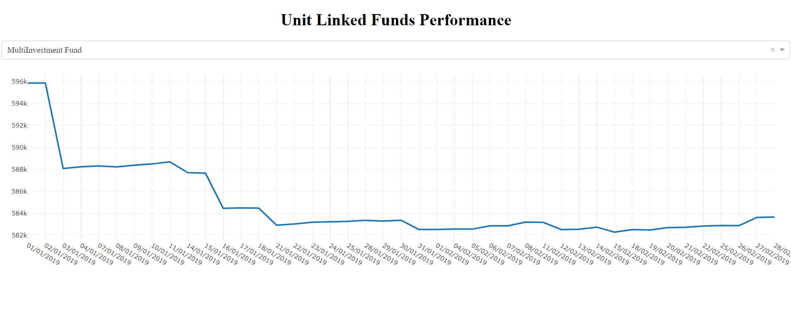

# dash-simple-example

This is a very simple example of Dash application showing performance of three unit-linked funds.

The application was build using open-source Python [Dash](https://plot.ly/products/dash/) and [Plotly](https://plot.ly/#/) libraries.

### App

